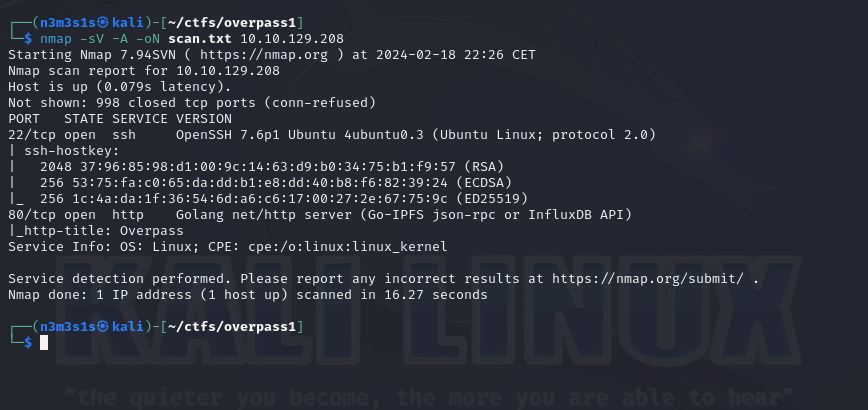

# Overpass 1 CTF tryhackme.com
> https://tryhackme.com/room/overpass

Als erstes Scannen wir die IP-Adresse nach offene Ports um uns ein überblick zu verschaffen:

es sind also 2 Ports offen.
SSH ist nicht angreifbar, aber http ist interesant also konzentrieren wir uns auf port 80.
